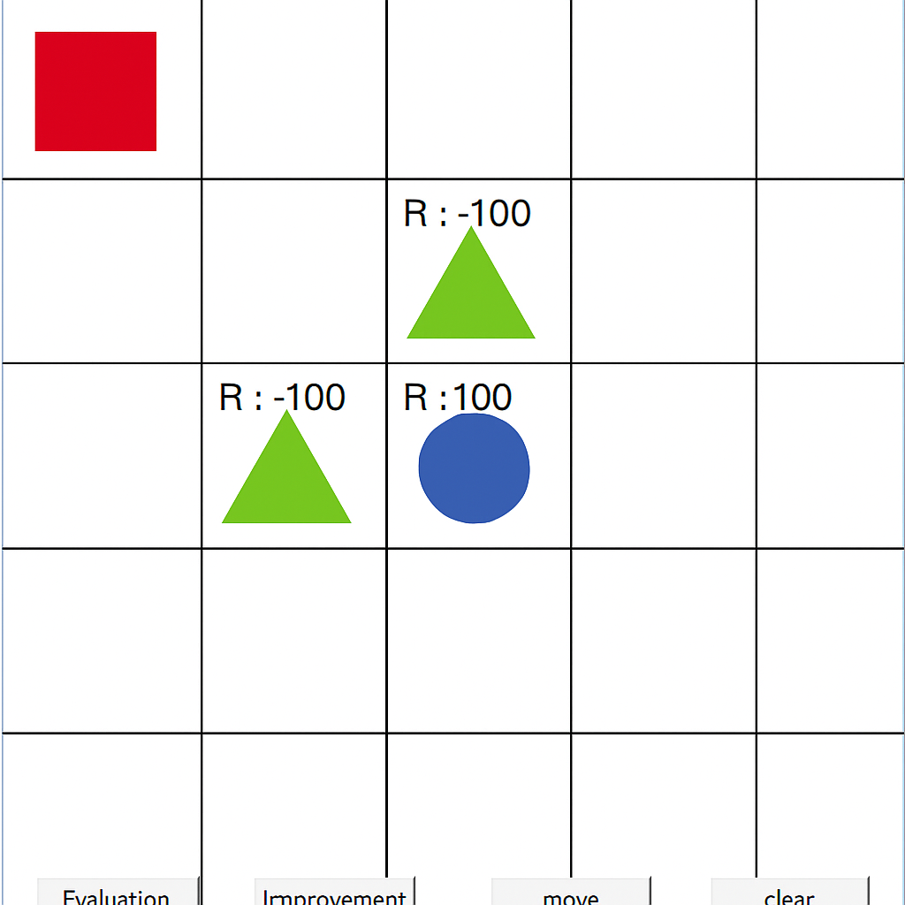
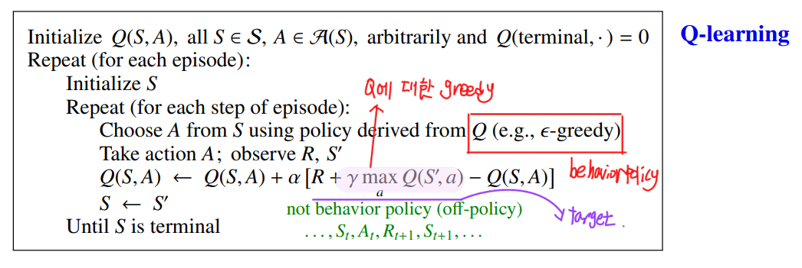
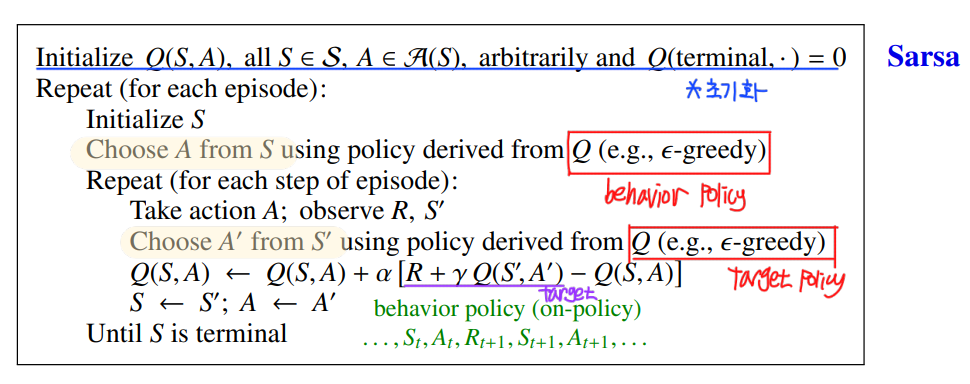
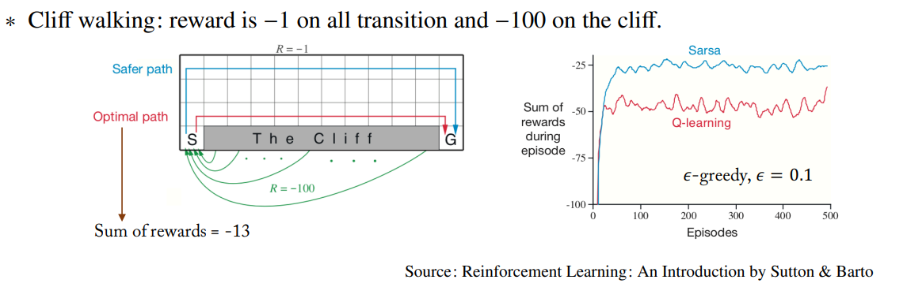

## Play

python3.8~3.9

그 이후로는 되는지 test 안해봄. 


```bash
pip install -r requirement.txt
```


## Environment

<p style="font-family:Arial; font-size:16px;">
5 x 5 grid world 
</p>

agent는 빨간색 rectangle이다.  
initialize state에서 agent는 좌측 최상단에 위치한다.

한번의 action 마다 agent는 상하좌우로 1칸씩만 이동 가능하다.  
terminal state는 초록색 triangle, 파란색 circle이다.  
agent가 초록색 triangle을 만나면 reward -100 을, 파란색 원을 만나면 reward 100을 얻으며, 그외엔 reward 0을 얻는다. 


<p align="center">
  
</p>


## Q-learning
<p align="center">
  
</p>

- $Q(S, A)$ update에 $Q(S', a)$가 사용되었으므로 bootstrapping
- 1-step transition인 $(S,A,R,S')$ 을 바탕으로 update가 진행 (TD 방식)
- Target policy는 Q에 대한 $\text{greedy}$, behavior policy는 Q에 대한 $\epsilon -\text{greedy}$ (Off policy)
- $Q^*$ 를 target으로 하여 학습이 진행되기 때문에 Bellman optimality equation 사용
- 직접 Optimal Q-function을 학습하기 때문에 성능 우수


## SARSA

<p align="center">
  
</p>

- $Q(S, A)$ update에 $Q(S', A')$가 사용되었으므로 bootstrapping
- 1-step transition인 $(S,A,R,S',A')$ 을 바탕으로 update가 진행(TD 방식)
- Target policy와 behavior policy가 Q에 대한 $\epsilon -\text{greedy}$ policy로 동일(On policy)
- $Q^\pi$를 target으로 하여 학습이 진행되기 때문에 Bellman expectation equation 사용


## Q1.
q_learning 폴더의 main_q를 debugging 해보면서 "?" 를 정답으로 채우시오.  
주의! state를 input으로 줄거라면 반드시 str(state)로 해야하며, environmnet.py에는 빈칸없습니다.


## Q2.
sarsa 폴더의 main_s를 debugging 해보면서 "?" 를 정답으로 채우시오.  
주의! state를 input으로 줄거라면 반드시 str(state)로 해야하며, environmnet.py에는 빈칸없습니다.


## Q3.
SARSA과 Q-learning을 돌렸을 때, 보기엔 SARSA가 굉장히 멍청한거 같다. 이에 대한 해결법을 서술하시오.  
(Hint: environment와 관련이 있다. Cliff Walking 에서는 왜 SARSA가 좋게 나왔을까?)

cliff walking에서 sarsa의 성능이 좋게 나온 이유는 q-learning에 대비해서 안정성을 추구하는 경향이 있기 때문에 cliff로부터 멀리 떨어져 경로를 찾게된다.
반면 q-learning의 경우 reward를 max하겠다는 mission-critic한 성향이 강하기 때문에 cliff에 떨어지더라도 최단경로를 찾게된다.
cliff와 현 env를 확인해보았을 때 한 번의 step을 할 때 reward가 [-1,0]이라는 차이점이 존재한다. 
이 부분에서 cliff에서는 이동할 때 -1 reward를 받기 때문에 reward를 max로 하게끔 하려는 성향이 강해져 성능이 좋게 나오지만
현재 env에서는 이동을 하여도 reward가 0이기 때문에 사실상 아무런 피드백이 없는 상황과 마찬가지 따라서 경로를 찾아가는 과정에서 다양한 피드백을 받지 못해서 성능이 떨어진다.

정답 : 이동할 때 reward를 0 -> -1로 변경해주면 된다.

<p align="center">
  
</p>


## Q4.
같은 ε-greedy 정책을 사용하더라도 Q-learning과 SARSA가 서로 다른 학습 결과를 보일 수 있는 이유는 무엇인가?
다음 보기 중 올바른 것을 모두 고르시오.

a. Q-learning은 실제로 선택된 행동을 사용하여 Q를 업데이트한다.

b. SARSA는 ε-greedy 정책에 따라 선택된 다음 행동을 학습에 사용한다.

c. Q-learning은 항상 최적의 행동만을 사용하여 Q를 업데이트한다.  

d. SARSA는 환경 모델을 알고 있어야 작동한다.

정답 : b, c


## Q5.
SARSA와 Q-learning 2가지 방식 모두 epsilon-greedy를 사용한다.  
그러나 SARSA는 그 값을 작게, Q-learning을 크게 사용한다.  
그 이유를 서술하시오.

sarsa는 선택가능한 행동들에 대한 다양한 학습을 원한다. -> 그래서 epsilon값을 작게해서 다른 행동들이 선택될 수 있는 충분한 가능성을 열어두는것이다. 
반면 q-learning의 경우는 2개의 policy(target policy, behavior policy)를 사용한다 -> 다른 policy를 이용해서 자신의 policy를 학습
따라서 다른 policy에서 나온 값을 충실히 따라야 할 의무가 있음으로(이미 best action이 정해져 있는데 다른 탐험을 굳이 할 필요는 없다.) epsilon값을 크게 사용하는 것이다.

## git push
```bash
git checkout -b your-branch-name
# 예: git checkout -b SH

git add .
git commit -m "message"
# 예: git commit -m "Add solution by SH"

git push origin your-branch-name
# 예: git push origin SH
```
